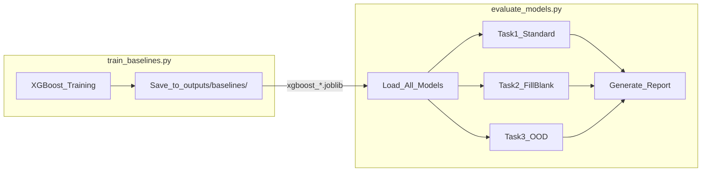

# MOIRAI 评估系统重构计划

## 设计意图与理由

### 为什么要重构评估指标？

**问题**：当前使用 R², CVRMSE 等指标在 HVAC 场景下会失效。

- HVAC 系统存在大量**稳态工况**（夜间停机功率=0、恒温设定点=24°C）
- R² 在方差极小时会因微小波动变成负无穷，无法反映真实预测质量
- MOIRAI 是**概率模型**，输出的是分布而非点值，传统点预测指标无法衡量不确定性估计能力

**解决方案**：采用 Time Series Foundation Model 论文（arXiv:2411.08888）中的标准指标体系：

- **SMAPE**: 对稳态数据友好，可跨量纲对比
- **CRPS**: 概率模型的原生指标，奖励准确的不确定性估计
- **MSIS**: 衡量置信区间质量，关注工业控制中的"最坏情况"

### 为什么需要 Baselines？

验证 Foundation Model 的价值需要对照组：

1. **Seasonal Naive**: 证明模型学到了比简单周期性更复杂的规律
2. **XGBoost**: 证明 Transformer 处理高维多传感器的优越性
3. **Zero-shot MOIRAI**: 证明 Fine-tuning 确实注入了建筑特有的物理知识（必须保留！）

### 为什么要三个评估任务？

| 任务 | 验证目标 |

|------|----------|

| **Standard Forecast** | 基础时间外推能力 |

| **Fill-in-the-Blank** | 因果链学习能力（核心创新点验证） |

| **OOD Stress Test** | 极端工况泛化能力 |

---

## 架构概览：训练与评估分离



**脚本职责分离**：

- `scripts/train_baselines.py`: 训练 XGBoost，保存到 `outputs/baselines/`
- `scripts/evaluate_models.py`: 只负责加载所有模型并评估，不做任何训练

---

## Part 1: 新建 `scripts/train_baselines.py`

训练传统 ML baselines，与评估脚本解耦。

```python
# 输入: data/buildingfm_processed/arrow/train.parquet
# 输出: outputs/baselines/xgboost_{group_name}.joblib
# 特征: Lag(1, 60, 1440, 10080), hour, dayofweek, month
```

---

## Part 2: 重构 `evaluate_models.py` 指标系统

### 2.1 核心指标 (Primary Metrics)

| 指标 | 说明 |

|------|------|

| **SMAPE** | `200 * mean(\|y-ŷ\| / (\|y\|+\|ŷ\|))`，相对误差，稳态友好 |

| **CRPS** | 概率分布与真值距离，奖励不确定性估计 |

| **MSIS** | 95% 置信区间得分，衡量区间覆盖率与宽度 |

### 2.2 辅助指标 (Secondary Metrics)

| 指标 | 说明 |

|------|------|

| **Smoothed MAE** | 滑动平均后 MAE，向非专业人员展示趋势准确性 |

| **Consistency** | 变量间相关系数差异，验证物理一致性 |

---

## Part 3: 评估模型对比组 (6 个模型)

```python
models = {
    'Seasonal Naive': ...,       # 周期性基线
    'XGBoost': ...,              # 传统 ML 强敌
    'Small (Zero-shot)': ...,    # MOIRAI-Small 预训练 (保留!)
    'Small (Fine-tuned)': ...,   # MOIRAI-Small Fine-tune
    'Base (Zero-shot)': ...,     # MOIRAI-Base 预训练 (保留!)
    'Base (Fine-tuned)': ...,    # MOIRAI-Base Fine-tune
}
```

---

## Part 4: 三大评估任务

### Task 1: Standard Forecasting

- 输入：过去 `CONTEXT_LENGTH` 时间步全部变量
- 输出：未来 `PREDICTION_LENGTH` 时间步的目标变量
- 指标：SMAPE, CRPS, MSIS
- 变量组：Main Power, ODU Power, IDU Power, Zone Temps, IAQ

### Task 2: Fill-in-the-Blank (逻辑链验证 - 核心创新)

利用 `metadata.json` 中的 `variable_groups` 进行逻辑链验证：

```
保留两端: weather (0-7) + zone_temps (50-97)
Mask 中间: power_odu (12-13)
```

让模型根据天气和室温**反推** ODU 功率，验证 `Weather → ODU → Indoor` 因果链学习。

- 只有 MOIRAI 能做此任务（XGBoost 无法处理任意 Mask）
- 指标：被 Mask 变量的 MAE + 物理一致性检验

### Task 3: OOD Stress Test

- 从测试集筛选极端工况片段：
  - 高温: 室外温度 > 35°C
  - 低温: 室外温度 < 5°C  
  - 高 CO2: CO2 > 1000 ppm
- 在这些片段上运行 Task 1，评估泛化能力

---

## Part 5: 输出文件

| 文件 | 内容 |

|------|------|

| `evaluation_results.csv` | 所有模型×变量组×指标的详细表格 |

| `training_curves.png` | 训练曲线（保留现有） |

| `metrics_comparison.png` | 6 模型指标对比柱状图 |

| `crps_distribution.png` | 各变量组 CRPS 箱线图 |

| `fill_in_blank.png` | 逻辑链验证：Mask 区域预测 vs 真值 |

| `ood_performance.png` | OOD 极端工况性能对比 |

| `sample_predictions.png` | 预测样例可视化（保留现有） |